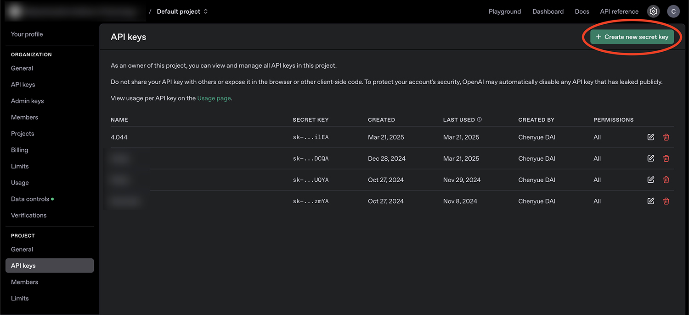

# PLEASE CAREFULLY READ THE INSTRUCTIONS BELOW !!!

This repository is for 4.043/4.044 Design Studio: Interaction Intelligence by Marcelo Coelho, it contains sample codes we think may be useful your project. All samples run on OpenAI's api.

## Instructions for acquiring an API key

API key is a "password" for the platform to recogize you without account info. You will acquire it from the platform and save it locally for your code to access it. DO NOT upload your key to any online platform including GitHub.

1. Open an [OpenAI Platform](https://platform.openai.com/) account, and purchase some credits.

2. Go to Settings > API Keys to create an API key

3. Copy and save it somewhere locally



## Instructions for running Python code

0. (Optional but recommended) Create a virtual environment if you understand what it is

1. Install necessary dependencies (the root command may be `python` or `python3` depending on your installation):

```
python3 -m pip install openai dotenv
```

2. For the python code you would like to run, create a text file named `.env` in the same folder and fill in the following line:

```
OPENAI_API_KEY=$REPLACE WITH YOUR API KEY$
```
For example if your API key is `sk-proj-xxxxxxxxxxxxxxxxxx...`, then you should put:
```
OPENAI_API_KEY=sk-proj-xxxxxxxxxxxxxxxxxx...
```


3. You should now be able to run the code

## Instructions for running JavaScript code

For chat and image api, I included an html page in each folder that performs same functions as python samples, linking corresponding javascript code for your reference.